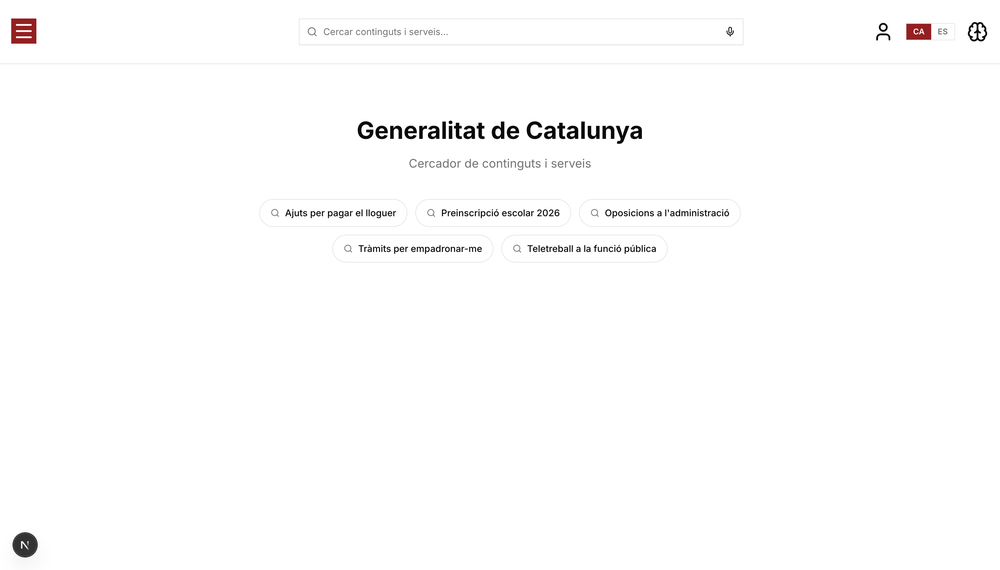
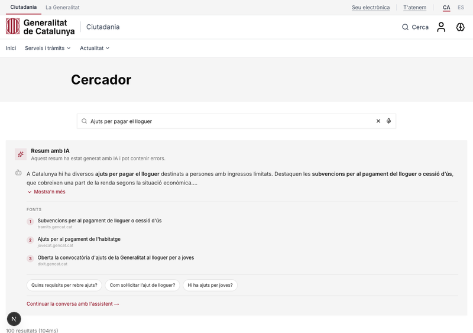
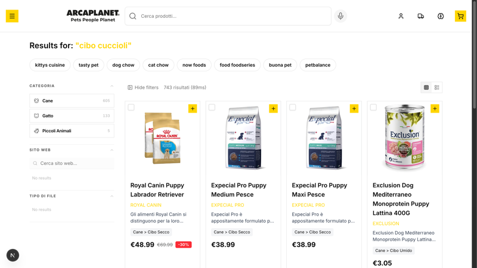

# Generalitat de Catalunya Demo

> AI-powered citizen search portal for the Government of Catalonia — demonstrating Agent Studio with structured inline AI summaries, bilingual support (Catalan/Spanish), and semantic government content discovery across 152K web pages.

**Live:** https://alg-gencat-demo.netlify.app

## Screenshots

| Homepage | AI Summary (`showSummary` tool) |
|----------|-------------------------------|
|  |  |

| Search Results |
|---------------|
|  |

## Use Case

- **Customer:** Generalitat de Catalunya (GenCat) — Government of Catalonia
- **Vertical:** Government / Public Sector
- **Audience:** Eduardo Capuano (AE) showing to Jonatan Freijomil (Head of Digital Experience) and Ricardo Garcia (Technical Lead)
- **Competitor:** Google Vertex AI
- **Key scenarios:** Citizens asking natural language questions about government services, procedures (tramits), subsidies, education, and employment — and getting AI-generated answers with source citations

## What Makes This Demo Different

This is a **government content discovery portal** built on the demo template, matching the real web.gencat.cat design. The data model uses Pages instead of Products — citizens search for government information across 152,475 bilingual web pages (Catalan + Spanish) crawled from `*.gencat.cat` subdomains. Instead of product cards with prices and cart actions, results are clean content listings with titles, snippets, source domains, and external links to official government pages.

The **3-layer navbar** replicates the real GenCat website exactly: top bar with "Ciutadania | La Generalitat" tabs, main bar with the official logo and "Cerca" button, and navigation links ("Inici", "Serveis i tramits", "Actualitat"). The search page features a "Cercador" hero banner with the search input in the page body — matching the government's existing UX so the demo feels like a natural evolution, not a foreign product.

The hero feature is a **structured AI summary with a dedicated `showSummary` client-side tool**. When a citizen presses Enter on a question like "Quins ajuts hi ha per pagar el lloguer?", a dedicated summary agent searches the index, then calls `showSummary` with structured data (summary text + source array). The client renders this progressively — the summary streams in token by token while sources appear as numbered citations. This directly addresses GenCat's pain point: citizens struggle to find answers spread across dozens of government subdomains.

The **bilingual CA/ES toggle** instantly filters search results by language, switches all UI strings, and changes the AI agent's response language. Follow-up suggestions from the summary agent appear as clickable pills that open the conversational sidepanel with full context — the transport's `enrichContext` automatically includes the previous summary so the agent can continue the conversation intelligently.

The demo UI matches the real site closely enough that during the presentation, the transition between "this is what you have" and "this is what Algolia adds" is seamless — the AI summary and improved search results appear as a natural layer on top of the familiar GenCat design, competing directly against Google Vertex AI.

## Features Highlighted

- **Structured AI Summary (`showSummary` tool)** — Dedicated summary agent searches the index, returns structured data (summary + sources), rendered progressively with streaming. Sources shown as numbered citations with domain labels.
- **Streaming Tool Calls** — Summary text appears token by token during `input-streaming` state, giving the illusion of instant response before the full tool call completes.
- **Follow-up Suggestions** — SSE `data-suggestions` events captured from the summary agent, displayed as clickable pills. Clicking opens the conversational sidepanel with `previousSummary` context injected via the transport's `enrichContext`.
- **Two-Agent Architecture** — Separate summary agent (inline, structured output) and conversational agent (sidepanel, freeform chat). Each optimized for its use case.
- **Bilingual Support (CA/ES)** — Language toggle filters the 152K bilingual index and switches all UI + agent prompts instantly.
- **GenCat-Matching UI** — 3-layer navbar, "Cercador" hero, search bar in page body, simple list results (underlined title + domain + snippet + divider), all matching web.gencat.cat.
- **NeuralSearch Active** — Semantic search enabled on the index with tuned neural expression weights (title, h1, snippet, h2). Critical for natural language Catalan queries.
- **Memoized Markdown** — `react-markdown` + `remark-gfm` with block-level memoization for streaming performance. Auto-links bare URLs.
- **Citizen Persona Personalization** — Four personas (family with school-age children, entrepreneur, job seeker, new visitor) boost relevant government topics.

## Customizations vs Template

### Data & Relevance
- **Record count:** 152,475 pages (index: `gencat_content`)
- **Data source:** Browsed from existing Algolia index on app `QPQAVM8S9W` (GenCat's production crawler index)
- **Key facets:** `ambito` (topic domain), `lang` (language), `domain` (source website), `mimeType` (file type), `hierarchical_categories` (topic hierarchy)
- **Searchable attributes:** `ambito`, `h1`, `h2`, `h3`, `title`, `url` (unordered)
- **NeuralSearch:** Active with weights — `title: 1.0`, `h1: 0.89`, `snippet: 0.8`, `h2: 0.5`

### Personalization
- **Familia amb fills en edat escolar** — Boosts education, teaching
- **Emprenedor buscant ajudes** — Boosts business, economy, financing
- **Persona buscant feina** — Boosts employment, public administration
- **Visitant nou** — No preferences (baseline)

### AI Agents
- **Assistent GenCat** (conversational) — Sidepanel agent. Searches government content, cites sources with URLs, responds in Catalan/Spanish based on UI language context. Has `showItems` and `showSummary` tools.
- **GenCat Summary** (inline) — Dedicated to structured summaries. Calls `algolia_search_index` then `showSummary` with structured output. Suggestions enabled.

### Architecture Changes (vs Template)
- **`Product` type -> `Page` type** — Replaced e-commerce interface with content interface (title, url, body, domain, ambito, lang, h1-h3, mimeType)
- **Cart/Checkout removed** — Stripped entirely; product detail redirects to external GenCat page
- **3-layer navbar** — Matches web.gencat.cat (top bar, logo bar, nav bar) instead of template's single-row layout
- **`InlineAISummary` component** — Handles `showSummary` tool call with streaming, memoized markdown, truncation, suggestions, and context handoff to sidepanel
- **`MemoizedMarkdown` component** — Block-level memoization with `marked.lexer()` + `react-markdown` + `remark-gfm`
- **`LanguageSwitcher` component** — CA/ES toggle with `LanguageProvider` context
- **Transport dedup** — `filterDataParts` deduplicates messages by ID to prevent Agent Studio API validation errors
- **Logo SVG** — Red coat of arms + dark text (original had white fills for dark backgrounds)

### Branding
- **Locale:** Catalan (`ca`) / Spanish (`es`), EUR
- **Visual identity:** GenCat institutional dark red (`#9B2335`), official coat of arms SVG, Catalan flag favicon
- **UI style:** Government portal aesthetic — gray hero banners, underlined link results, numbered source citations

## Running This Demo

```bash
pnpm install
PORT=3005 pnpm dev
```

Requires `.env` with `ALGOLIA_ADMIN_API_KEY` (for the target app `3FKQCCIUWO`) to run indexing or agent setup scripts. Search works with the committed search-only key.

```bash
pnpm tsx scripts/setup-agent.ts   # Deploy both agents
pnpm tsx scripts/index-data.ts    # Re-index from source
```

## Tech Stack

Next.js 16, React 19, Algolia Composition API, Agent Studio, AI SDK v5, Tailwind CSS 4, shadcn/ui, react-markdown, remark-gfm.
