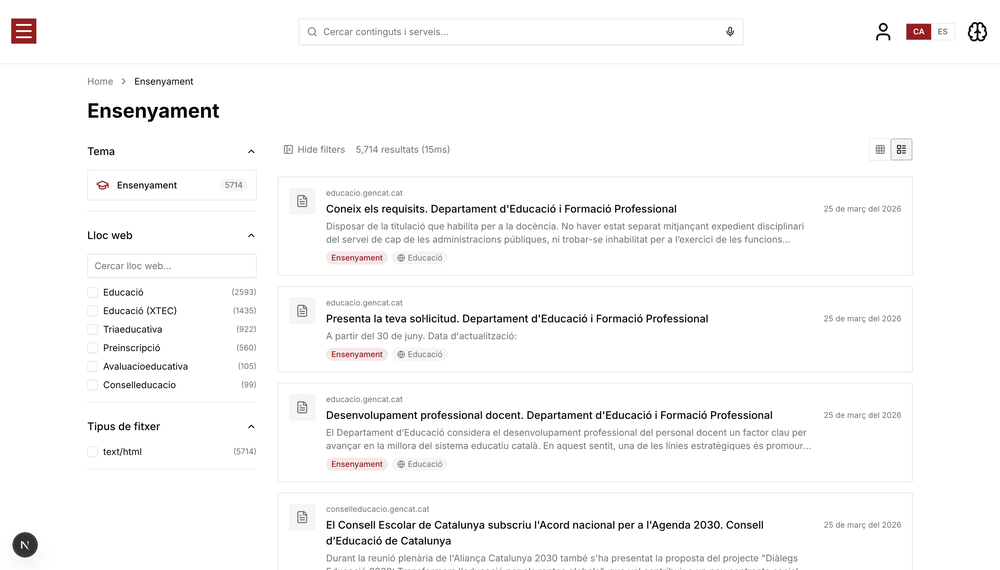

# Generalitat de Catalunya Demo

> AI-powered citizen search portal for the Government of Catalonia — demonstrating Agent Studio with inline AI summaries, bilingual support (Catalan/Spanish), and semantic government content discovery across 132K web pages.

**Live:** https://alg-gencat-demo.netlify.app

## Screenshots

| Homepage | Search Results |
|----------|---------------|
|  |  |

| Category Page |
|---------------|
|  |

## Use Case

- **Customer:** Generalitat de Catalunya (GenCat) — Government of Catalonia
- **Vertical:** Government / Public Sector
- **Audience:** Eduardo Capuano (AE) showing to Jonatan Freijomil (Head of Digital Experience) and Ricardo Garcia (Technical Lead)
- **Competitor:** Google Vertex AI
- **Key scenarios:** Citizens asking natural language questions about government services, procedures (tràmits), subsidies, education, and employment — and getting AI-generated answers with source citations

## What Makes This Demo Different

This is not an e-commerce demo — it's a complete reimagining of the template as a **government content discovery portal**. The entire Product/Cart/Checkout model was stripped out and replaced with a Page/Content/Sources model. Instead of shopping for products, citizens search for government information across 132,706 bilingual web pages (102K Catalan + 30K Spanish) crawled from `*.gencat.cat` subdomains.

The hero feature is an **inline AI summary with sources** — when a citizen presses Enter on a question like "Quins ajuts hi ha per pagar el lloguer?", an Agent Studio-powered answer appears above search results with numbered source citations linking to actual GenCat pages. This directly addresses GenCat's pain point: citizens struggle to find answers spread across dozens of government subdomains. The demo shows how Algolia + Agent Studio can provide a unified, intelligent answer layer on top of their existing content.

The **bilingual CA/ES toggle** is a live language switcher that instantly filters search results by language, switches all UI strings, and changes the AI agent's response language — demonstrating Algolia's multilingual capabilities for Catalonia's bilingual population.

The demo competes directly against Google Vertex AI, so it emphasizes search intelligence (semantic understanding of Catalan administrative vocabulary), source citation trustworthiness, and the ability to personalize results by citizen persona (parent, job seeker, entrepreneur).

## Features Highlighted

- **Inline AI Summary + Sources** — Agent Studio generates a concise answer above search results with numbered citations to GenCat pages. Triggered on Enter press. The key differentiator vs Google Vertex.
- **Bilingual Support (CA/ES)** — Language toggle filters the 132K bilingual index and switches all UI + agent prompts instantly.
- **Sidepanel Conversational Agent** — "Assistent GenCat" for follow-up questions, deployed via Agent Studio with Catalan-first instructions.
- **Government Content Cards** — Replaced product cards with content-focused cards showing title, snippet, topic badge, source site badge, file type (HTML/PDF), and external link to the real GenCat page.
- **Topic-Based Faceting** — Filters by government domain (Educació, Salut, Treball, Empresa, etc.), source website, and file type instead of price/brand/color.
- **Citizen Persona Personalization** — Four personas (family with school-age children, entrepreneur, job seeker, new visitor) boost relevant government topics.

## Customizations vs Template

### Data & Relevance
- **Record count:** 132,706 pages (102K Catalan + 30K Spanish)
- **Data source:** Browsed from existing Algolia index `pro_GENCAT` on app `QPQAVM8S9W` (GenCat's production crawler index)
- **Key facets:** `ambitoLabel` (topic domain), `lang` (language), `siteLabel` (source website), `mimeType` (file type), `hierarchical_categories` (topic hierarchy)
- **Enrichments:** Snippet generation from body text, ambito code → readable Catalan labels mapping, site domain extraction and labeling
- **Transform logic:** `scripts/index-data.ts` pulls from a source Algolia app (cross-app browse), maps 40+ ambito codes to human-readable labels, extracts site domains, generates snippets, and builds hierarchical categories from topic arrays

### Personalization
- **Família amb fills en edat escolar** — Boosts education, teaching
- **Emprenedor buscant ajudes** — Boosts business, economy, financing
- **Persona buscant feina** — Boosts employment, public administration
- **Visitant nou** — No preferences (baseline)

### AI Agent
- **Agent name:** Assistent GenCat
- **Key capabilities:** Searches government content, cites sources with URLs, responds in Catalan/Spanish based on UI language context
- **Custom tools:** `showItems` only (cart removed — no purchases in government portal). The `addToCart` tool was removed entirely.
- **Notable instructions:** Full Catalan instructions with guidance on filtering by `ambitoLabel` and `siteDomain`, always citing sources, and handling the inline summary request type concisely

### Architecture Changes (vs Template)
- **`Product` type → `Page` type** — Completely replaced the 77-line e-commerce interface with a 30-line content interface (title, url, body, snippet, ambito, siteDomain, siteLabel, lang, mimeType)
- **Cart/Checkout removed** — CartProvider stripped from providers, checkout page redirects to `/`, cart sheet emptied
- **Product detail page → redirect** — `/products/[id]` fetches the page's URL from Algolia and redirects to the external GenCat page
- **New component: `InlineAISummary`** — Calls Agent Studio via a separate `useChat` instance, streams markdown response, parses source URLs, renders two-column summary+sources card
- **New component: `LanguageSwitcher`** — CA/ES toggle with `LanguageProvider` context that filters search results via `facetFilters: ["lang:ca|es"]`
- **Translation system** — `lib/demo-config/translations.ts` with ~50 keys, `useLanguage()` hook providing `t()` function

### Branding
- **Locale:** Catalan (`ca`) / Spanish (`es`), EUR
- **Category depth:** 2 levels (topic → subtopic from ambito values)
- **Visual identity:** GenCat institutional dark red (`rgb(192, 0, 0)` / `oklch(0.45 0.18 25)`), official SVG logo from web.gencat.cat, favicon from site

## Running This Demo

```bash
pnpm install
pnpm dev
```

Requires `.env` with `ALGOLIA_ADMIN_API_KEY` (for the target app `3FKQCCIUWO`) to run indexing scripts. Search works with the committed search-only key.

To re-index data from the source GenCat index:
```bash
pnpm tsx scripts/index-data.ts
```

## Tech Stack

Next.js 16, React 19, Algolia Composition API, Agent Studio, AI SDK v5, Tailwind CSS 4, shadcn/ui.
