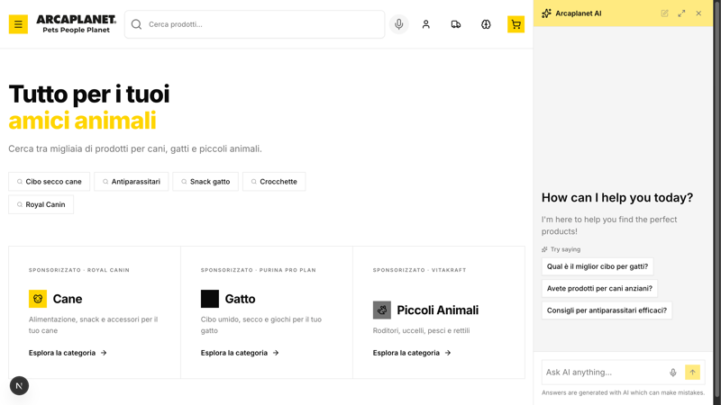
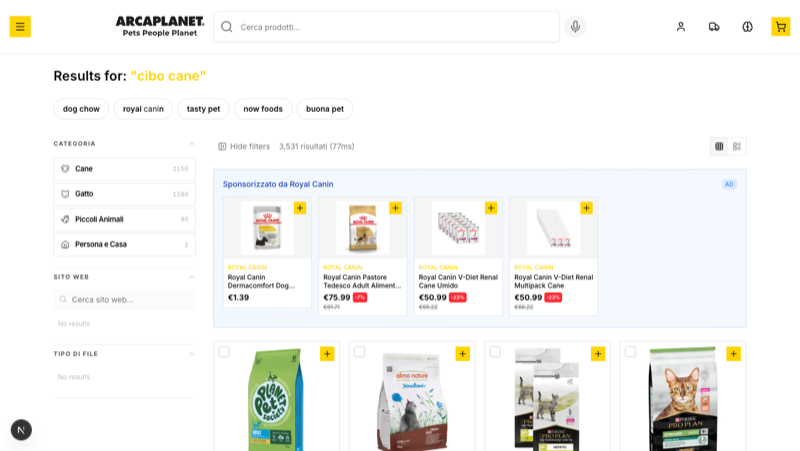
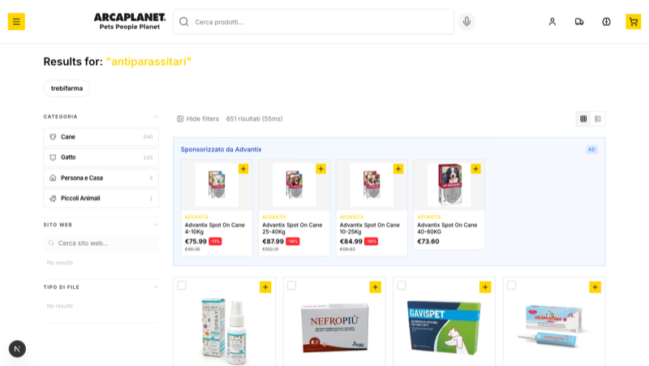
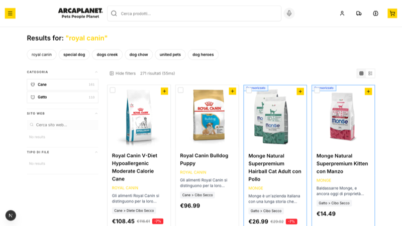
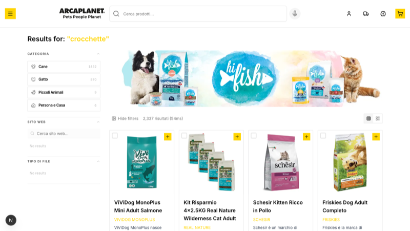

# Arcaplanet Demo

> Italian pet store e-commerce demo showcasing retail media, Click & Collect, AI-powered guided purchase assistant, and deep pet-specific faceting across 10,000+ products.

## Screenshots

| Homepage | Search Results |
|----------|---------------|
|  |  |

| Category Page | AI Agent |
|---------------|----------|
|  |  |

## Use Case

- **Customer:** Arcaplanet — Italy's largest pet store chain (500+ stores)
- **Vertical:** Pet retail / E-commerce
- **Audience:** AE showing to Arcaplanet digital team
- **Key scenarios:** Retail media monetization, omnichannel Click & Collect with store availability, AI shopping assistant with guided purchase flow for pet owners

## What Makes This Demo Different

This demo goes well beyond standard e-commerce search. It tells a **retail media revenue story** — showing how Arcaplanet can monetize their search traffic by letting brands like Royal Canin, Monge, Purina, and Advantix sponsor search results through carousel takeovers, inline sponsored cards, and cross-sell banners. Each rule models a real paid placement: brand sponsorship ("Royal Canin owns dog food searches"), conquest campaigns ("Monge appears when users search Royal Canin"), and cross-category upsells ("suggest snacks when browsing kibble"). The homepage itself features sponsored category cards with brand attribution.

The **Click & Collect** system adds an omnichannel dimension — customers can search for a nearby Arcaplanet store, see real-time stock availability per product, and choose in-store pickup. This is powered by a dedicated locations index with store data across Italy.

The **AI shopping assistant** speaks Italian and follows a guided purchase flow designed for pet owners: it profiles the animal (species, age, size, health needs) through conversational questions, then searches with precise filters (e.g., `età.value:PUPPY + taglia.value:MEDIA`), presents 2-3 options with explanations, and cross-sells complementary products. The pet-specific attribute system (età, razza, taglia, gusto, funzione, formato) enables faceted filtering that mirrors how a knowledgeable store associate would guide a customer.

The data comes from Arcaplanet's VTEX e-commerce platform — 10,124 real products with images, pricing, descriptions, and rich pet-specific metadata, all in Italian with EUR pricing.

## Features Highlighted

- **Retail Media** — Sponsored carousels, inline ads, and banners triggered by search queries and category filters. Models real CPM/CPC campaign types with brand attribution labels.
- **Click & Collect** — Store locator with address search, map view, and per-product stock availability badges. Powered by a separate `arcaplanet_locations` Algolia index.
- **AI Guided Purchase** — Italian-speaking agent that profiles the pet (species, age, size, needs), searches with targeted filters, presents options with explanations, and cross-sells intelligently.
- **Pet-Specific Faceting** — Filterable attributes for animal age (PUPPY/ADULTO/ANZIANO), breed, size, flavor, health function, and packaging format.
- **Deep Category Hierarchy** — 4 animal types (Cane, Gatto, Piccoli Animali, Persona e Casa) with 3 levels of subcategories matching Arcaplanet's real catalog structure.
- **Personalization** — Two personas (new puppy owner, senior dog owner) with preference weights on age, brand, and category — boosting relevant products in search and agent responses.
- **Query Suggestions** — Homepage shows popular search pills (Cibo secco cane, Antiparassitari, Snack gatto, Crocchette, Royal Canin) for quick discovery.

## Customizations vs Template

### Data & Relevance
- **Product count:** 10,124 products
- **Data source:** Arcaplanet VTEX e-commerce platform (JSON export with VTEX items/sellers structure)
- **Key facets:** `brand`, `hierarchical_categories` (3 levels), `età.value`, `razza.value`, `taglia.value`, `gusto.value`, `funzione.value`, `formato.value`, `conservazione.value`, `consistenza.value`, `tipo.value`, `price.value`, `reviews.rating`, `discount_rate`
- **Enrichments:** Synthetic business metrics (sales velocity, margin, AOV), synthetic reviews with Bayesian averaging, HTML entity stripping for Italian characters, `categoryPageId` and `searchable_categories` derived from hierarchical categories
- **Transform logic:** `scripts/index-data.ts` filters VTEX records, extracts pricing from items/sellers structure, converts hierarchical categories from arrays to strings, maps `shopAvailability` to store objectIDs, and generates deterministic synthetic metrics from objectID hashes

### Personalization
- **Nuovo proprietario cucciolo** — Boosts puppy food, snacks, toys, Royal Canin, PUPPY age
- **Proprietario cane anziano** — Boosts diet food, health products, Royal Canin, ANZIANO age, weight control

### AI Agent
- **Agent name:** Arcaplanet Shopping Assistant
- **Key capabilities:** Multi-turn guided purchase (profile animal → search with filters → present options → cross-sell), Algolia Recommend for related products, cart management
- **Custom tools:** `algolia_search_index`, `recommend_related_products`, `addToCart`, `showItems`
- **Notable instructions:** Full Italian instructions with a 5-step guided purchase flow (profile → filter → present → cross-sell → close). Knows all pet attribute values for precise filtering. Responds with pet-themed emoji personality.

### Retail Media — How Composition Rules Power Sponsored Placements

Retail media in this demo is powered by **Algolia Composition Rules** — the same rules engine used for merchandising, but repurposed to inject sponsored products into search results at specific positions.

#### How it works

1. **Rules are defined** in `lib/demo-config/retail-media.ts` — each rule specifies a trigger (query or filter match), a source (Algolia filter for the sponsor's products), and a placement type (carousel, inline, or banner).

2. **Rules are deployed** to the Composition via `scripts/setup-composition-rules.ts`, which calls `POST /1/compositions/{compositionID}/rules/batch`. Each rule becomes a composition rule with:
   - A **condition** — `{ pattern: "cibo cane", anchoring: "contains" }` for query triggers, or `{ filters: 'hierarchical_categories.lvl0:"Cane"' }` for filter triggers
   - A **consequence** — injects products from a filtered search (e.g., `brand:"ROYAL CANIN" AND hierarchical_categories.lvl0:"Cane"`) at a specific position in the result set
   - An **injectedItemKey** — encoded as `"{placement}:{label}"` (e.g., `"carousel:Royal Canin"`) which the frontend parses to choose the visualization component

3. **The frontend classifies hits** — `lib/retail-media.ts` reads `_rankingInfo.composed[compositionID].injectedItemKey` from each hit to sort them into buckets: carousel products get extracted to a `<SponsoredCarousel>` above results, banner products go to a `<SponsoredBanner>` between rows, and inline products stay in the grid with a "Sponsorizzato" badge overlay.

4. **Deduplication** — if a sponsored product would also appear organically, composition's `deduplication: { positioning: "highest" }` keeps it at the sponsored position only.

#### Placement types in action

**Carousel** — Brand sponsorship. A horizontal scrollable strip above organic results with the sponsor's logo and "AD" badge. Only one carousel per page.

| Search "cibo cane" — Royal Canin carousel | Search "antiparassitari" — Advantix carousel |
|-------------------------------------------|----------------------------------------------|
|  |  |

**Inline** — Conquest campaign. Sponsored products injected directly into the result grid at position 2, with a small "Sponsorizzato" + brand label. Stays mixed with organic results so the user sees them naturally.

| Search "royal canin" — Monge conquest cards mixed into results |
|----------------------------------------------------------------|
|  |

> Monge pays to appear when users search for competitor Royal Canin — a classic conquest campaign (high CPC, high conversion intent).

**Banner** — Cross-category upsell. A full-width amber band injected between result rows, showing complementary products with a contextual CTA. Retailer-driven (not brand-funded) to increase basket size.

| Search "crocchette" — Cross-sell snack banner between results |
|---------------------------------------------------------------|
|  |

> When a customer searches for kibble, a banner suggests dog snacks — increasing average order value by promoting complementary categories.

**Homepage sponsorship** — Category cards on the homepage show brand attribution (e.g., "Sponsorizzato · Royal Canin" on the Cane card). This is hardcoded in the homepage component, not a composition rule — it models a homepage takeover package.

#### All 9 campaign rules

| Rule | Placement | Trigger | Sponsor | Products |
|------|-----------|---------|---------|----------|
| `royal_canin_dog_food` | Carousel | Query: "cibo cane", "cibo secco cane", "cibo cucciolo" | Royal Canin | Dog products by Royal Canin (4 hits) |
| `monge_conquest` | Inline | Query: "royal canin" | Monge | All Monge products (2 hits) |
| `almo_nature_cat_wet_food` | Inline | Filter: `Gatto > Cibo Umido` | Almo Nature | Almo Nature products (2 hits) |
| `cross_sell_snacks` | Banner | Query: "crocchette", "crocchette cane" | Retailer | Dog snacks (3 hits) |
| `advantix_antiparassitari` | Carousel | Query: "antiparassitari", "pulci", "zecche" | Advantix | Advantix products (4 hits) |
| `purina_cat_snacks` | Inline | Query: "snack gatto", "premio gatto" | Purina | Purina cat products (2 hits) |
| `royal_canin_dog_category` | Carousel | Filter: `Cane` category | Royal Canin | Royal Canin dog products (4 hits) |
| `purina_cat_category` | Carousel | Filter: `Gatto` category | Purina Pro Plan | Purina Pro Plan cat products (4 hits) |
| `vitakraft_small_animals` | Inline | Filter: `Piccoli Animali` category | Vitakraft | Vitakraft products (2 hits) |

#### Debug overlay

Append `?retail_media=true` to any URL to show a floating debug overlay (bottom-right) that displays which rules fired, their placement type, and sponsored vs organic product counts. Useful during demo presentations.

### Click & Collect
- **Store locator** with address search and interactive map
- **Per-product availability badges** based on `availableInStores` field
- **Dedicated locations index** (`arcaplanet_locations`) for store data

### Branding
- **Locale:** Italian / EUR
- **Category depth:** 3 levels (Animal > Product Type > Subcategory)
- **Visual identity:** Arcaplanet yellow (`#FFD700`) and black brand colors, official logo SVG, Italian UI throughout

## Running This Demo

```bash
pnpm install
pnpm dev
```

Requires `.env` with `ALGOLIA_ADMIN_API_KEY` for indexing scripts. Search works with the committed search-only key.

## Tech Stack

Next.js 16, React 19, Algolia Composition API, Agent Studio, AI SDK v5, Tailwind CSS 4, shadcn/ui.
